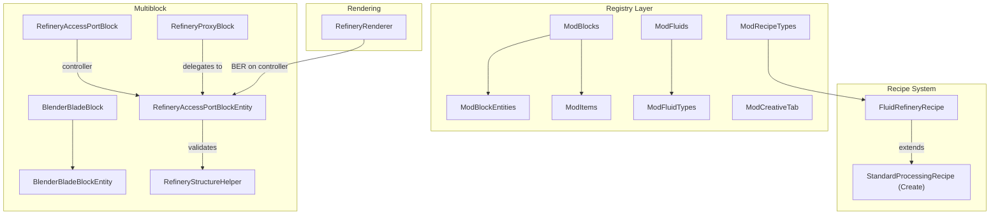
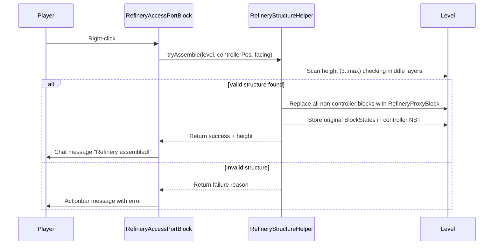

# Fluid Refinery — Implementation Plan

## Project Context

| Property | Value |
|---|---|
| **Mod ID** | `resourceful_refinement` |
| **Package** | `com.resourceful_refinement` |
| **MC Version** | 1.21.1 |
| **NeoForge** | 21.1.219 |
| **Create** | 6.0.11-283 |
| **Java** | 21 |

> [!NOTE]
> This plan implements the **Fluid Refinery multiblock** end-to-end — from mod foundation through to a working demo recipe that produces a custom fluid. Art assets use placeholders; the segmented BER renders coloured cubes rather than final models.

---

## Architecture Overview



---

## Phase 1 — Mod Foundation & Registries

**Goal:** Establish the deferred-register infrastructure every subsequent phase depends on.

### Files to Create

| File | Purpose |
|---|---|
| `registry/ModBlocks.java` | `DeferredRegister.Blocks` — all block registrations |
| `registry/ModItems.java` | `DeferredRegister.Items` — block items + standalone items |
| `registry/ModBlockEntities.java` | `DeferredRegister<BlockEntityType<?>>` |
| `registry/ModFluids.java` | `DeferredRegister<Fluid>` — source & flowing fluids |
| `registry/ModFluidTypes.java` | `DeferredRegister<FluidType>` (NeoForge registry) |
| `registry/ModRecipeTypes.java` | `DeferredRegister<RecipeType<?>>` + `DeferredRegister<RecipeSerializer<?>>` |
| `registry/ModCreativeTab.java` | `DeferredRegister<CreativeModeTab>` |

### Files to Modify

| File | Change |
|---|---|
| `ResourcefulRefinementMain.java` | Call `.register(modEventBus)` on every deferred register in constructor |

### Key Details

- Use `DeferredRegister.createBlocks(MOD_ID)` / `.createItems(MOD_ID)` convenience methods.
- `ModBlocks` should be classloaded **before** `ModItems` (items reference blocks).
- All registers initialised via a single `ModRegistries.init(IEventBus)` helper called from the main class constructor.
- Add a `lang/en_us.json` stub with display names for every registered object.

---

## Phase 2 — Blender Blade Block

**Goal:** A simple shaft-like block that will sit in the centre column of the refinery.

### Files to Create

| File | Purpose |
|---|---|
| `content/refinery/BlenderBladeBlock.java` | Directional block (axis property), no collision box when spinning, damages entities |
| `content/refinery/BlenderBladeBlockEntity.java` | Stores rotational state; later integrates with Create kinetics |

### Design Notes

- Block has a `AXIS` property (`Direction.Axis`). Default Y axis.
- For this initial implementation the blade is a simple full-cube placeholder; it does **not** need to connect to Create's rotation network yet (that can be Phase 2b or a follow-up).
- Register in `ModBlocks`, `ModItems` (block item), and `ModBlockEntities`.
- Placeholder texture: solid grey 16×16 PNG.

---

## Phase 3 — Refinery Access Port & Proxy Blocks

**Goal:** The two block types that compose the assembled multiblock.

### 3A — Refinery Access Port (Controller)

#### Files to Create

| File | Purpose |
|---|---|
| `content/refinery/RefineryAccessPortBlock.java` | The controller block. `HorizontalDirectionalBlock` with `FACING` property. `EntityBlock` implementation. Right-click triggers assembly. |
| `content/refinery/RefineryAccessPortBlockEntity.java` | Holds all multiblock state: assembled flag, structure dimensions, fluid tanks (2 input + 1 output), item handler (2 input slots), fuel/heat level, crafting progress timer. Manages sided capability exposure. |

#### Key Behaviours

- **`useWithoutItem()`** → if not assembled, call `RefineryStructureHelper.tryAssemble()`. If assembled, open GUI (GUI is out of initial scope — print chat feedback for now).
- **`onRemove()`** → if assembled, call disassemble logic.
- Stores `structureHeight` (3–max), `structureSize` (3 for 3×3; only 3×3 in v1).
- Exposes `IFluidHandler` on the **front face** (output only) and `IItemHandler` for fuel on **bottom-layer corner side faces**.

### 3B — Refinery Proxy Block

#### Files to Create

| File | Purpose |
|---|---|
| `content/refinery/RefineryProxyBlock.java` | Invisible (render type = invisible / `Blocks.AIR`-like, but not air). Stores controller position. Right-click delegates to controller. Breaking triggers disassembly. |
| `content/refinery/RefineryProxyBlockEntity.java` | Minimal BE storing `BlockPos controllerPos`. Delegates capability queries to controller based on its own relative position & face. |

#### Key Behaviours

- `getRenderShape()` → `INVISIBLE`.
- `getShape()` returns a full cube so it has collision and selection box.
- `onRemove()` → finds controller → triggers disassembly.
- `useWithoutItem()` → delegates to controller's use method.
- Capabilities are resolved by the proxy checking its own **relative position** within the structure and the **queried face**, then forwarding to the appropriate handler on the controller:
  - Top-layer back corners, top face → fluid input handler (tank 1 or tank 2 based on east/west side).
  - Top-layer front corners, outward side faces → item input handler.
  - Bottom-layer corners, outward side faces → fuel item handler.
  - Top/bottom centre, top/bottom face → rotational input (future Create integration).

---

## Phase 4 — Multiblock Validation, Assembly & Disassembly

**Goal:** The structure scanning, pattern matching, assembly into proxy blocks, and tear-down.

### Files to Create

| File | Purpose |
|---|---|
| `content/refinery/RefineryStructureHelper.java` | Static utility class with `tryAssemble()` and `disassemble()` methods |

### Structure Pattern (3×3 base, variable height ≥ 3)

Using local coordinates where the **Refinery Access Port** is at `(1, 0, 0)` (centre of north edge at ground level), facing north. All positions are relative to the controller, rotated by its `FACING`.

#### Bottom Layer (y = 0) — 3×3
```
[ Blaze Burner ] [ Copper Casing ] [ Blaze Burner ]    ← back row (south)
[ Copper Casing] [ Copper Casing ] [ Copper Casing]    ← middle row
[ Blaze Burner ] [ACCESS PORT ★ ] [ Blaze Burner ]    ← front row (north)
```

#### Middle Layers (y = 1 … height-2) — 3×3
```
[ Glass ] [ Glass ] [ Glass ]
[ Glass ] [Blender ] [ Glass ]
[ Glass ] [ Glass ] [ Glass ]
```

#### Top Layer (y = height-1) — 3×3
```
[ Fluid Tank  ] [ Glass        ] [ Fluid Tank  ]    ← back row
[ Glass       ] [ Blender Blade] [ Glass       ]
[ Item Vault  ] [ Glass        ] [ Item Vault  ]    ← front row
```

### Assembly Flow



### Disassembly Flow

1. Triggered when controller is broken, or any proxy is broken/replaced.
2. Controller iterates stored block map and replaces each proxy with its original `BlockState`.
3. Controller clears assembled flag and stored data.
4. Drops any items/fluids currently in the inventories (or retains in controller — design choice; I recommend **retaining in the Access Port block entity** since it persists).

### Key Implementation Details

- **Original block storage:** Controller BE stores a `Map<BlockPos, BlockState>` (relative positions → original states) in NBT via `saveAdditional` / `loadAdditional`.
- **Height scanning:** Start at y=1 above controller and keep going up while blocks match the middle-layer pattern. Then check if the top-layer pattern sits at that height. Accept if total height ≥ 3.
- **Rotation:** All patterns are rotated based on the Access Port's `FACING`. Use a helper method `rotateOffset(BlockPos offset, Direction facing)` to transform local coords to world coords.

---

## Phase 5 — Recipe Type (`fluid_refinery`)

**Goal:** A Create-compatible processing recipe type.

### Files to Create

| File | Purpose |
|---|---|
| `content/refinery/recipe/FluidRefineryRecipe.java` | Extends `StandardProcessingRecipe<RecipeInput>`. Validates ≤2 item ingredients, ≤2 fluid ingredients, exactly 1 fluid result. |
| `content/refinery/recipe/FluidRefineryRecipeInput.java` | Custom `RecipeInput` wrapping the controller's current item + fluid contents for matching |

### Registration (in `ModRecipeTypes.java`)

```java
public static final DeferredHolder<RecipeType<?>, RecipeType<FluidRefineryRecipe>> FLUID_REFINERY_TYPE =
    TYPE_REGISTER.register("fluid_refinery", () -> RecipeType.simple(
        ResourceLocation.fromNamespaceAndPath(MOD_ID, "fluid_refinery")));

public static final DeferredHolder<RecipeSerializer<?>, RecipeSerializer<FluidRefineryRecipe>> FLUID_REFINERY_SERIALIZER =
    SERIALIZER_REGISTER.register("fluid_refinery",
        () -> new StandardProcessingRecipe.Serializer<>(FluidRefineryRecipe::new));
```

### Recipe JSON Format (matches design doc)

```json
{
  "type": "resourceful_refinement:fluid_refinery",
  "heat_requirement": "heated",
  "processing_time": 200,
  "ingredients": [
    { "item": "minecraft:raw_iron", "count": 1 },
    { "type": "neoforge:single", "amount": 1000, "fluid": "minecraft:lava" }
  ],
  "results": [
    { "fluid": "resourceful_refinement:molten_crimsite", "amount": 500 }
  ]
}
```

> [!IMPORTANT]
> By extending `StandardProcessingRecipe` and using Create's `ProcessingRecipeParams` codec, we get `heat_requirement`, `processing_time`, mixed item+fluid ingredients, and mixed item+fluid results **for free**. The only custom work is the validation logic (max 2 items, max 2 fluids in, exactly 1 fluid out).

### `IRecipeTypeInfo` Implementation

Create a simple record/class implementing `IRecipeTypeInfo` so the recipe integrates cleanly with Create's builder and JEI systems:

```java
public record RefineryRecipeTypeInfo(ResourceLocation id,
    Supplier<RecipeSerializer<?>> serializer,
    Supplier<RecipeType<?>> type) implements IRecipeTypeInfo { ... }
```

---

## Phase 6 — Crafting Logic & Heat System

**Goal:** The controller ticks, matches recipes, consumes inputs, and produces output.

### Implementation in `RefineryAccessPortBlockEntity`

#### Tick Logic (server-side)

```
every tick (when assembled):
  1. Consume fuel items → update heatLevel + burnTimeRemaining
  2. Decrement burnTimeRemaining; if 0, drop heatLevel
  3. If no current recipe cached:
       - Build FluidRefineryRecipeInput from current tanks + items
       - Query RecipeManager for matching FluidRefineryRecipe
       - If found, cache it and set craftingProgress = 0
  4. If recipe cached:
       - Verify inputs still match & heat requirement met
       - If not, reset craftingProgress and clear cache
       - Increment craftingProgress
       - If craftingProgress >= recipe.processingTime:
           - Consume inputs (drain fluids, shrink items)
           - Fill output tank with result fluid
           - Reset craftingProgress, clear cached recipe
```

#### Heat System

| Heat Level | Burn-time source | Equivalent |
|---|---|---|
| NONE | No fuel consumed | `HeatCondition.NONE` |
| HEATED | Standard fuel items (coal, etc.) | `HeatCondition.HEATED` |
| SUPERHEATED | Blaze cakes / lava buckets | `HeatCondition.SUPERHEATED` |

- Fuel is accepted through the bottom-layer corner side faces.
- Use `ForgeHooks.getBurnTime()` (or NeoForge equivalent `CommonHooks.getBurnTime()`) to determine burn duration.
- Store `int burnTimeRemaining` and `HeatCondition currentHeat` in the BE.
- For superheated, check if fuel item is a blaze cake (Create's `AllItems.BLAZE_CAKE`) or has >1600 burn time.

#### Internal Storage

| Storage | Type | Capacity |
|---|---|---|
| Input Tank A | `FluidTank` (NeoForge) | 4000 mB |
| Input Tank B | `FluidTank` (NeoForge) | 4000 mB |
| Output Tank | `FluidTank` (NeoForge) | 4000 mB |
| Item Input (2 slots) | `ItemStackHandler` | 64 per slot |
| Fuel Input (1 slot) | `ItemStackHandler` | 64 |

---

## Phase 7 — Molten Crimsite Fluid

**Goal:** Register one modded fluid so we can create a testable recipe.

### Files to Create

| File | Purpose |
|---|---|
| `content/fluids/MoltenCrimsiteFluid.java` | `FlowingFluid` subclass (Source + Flowing inner classes) with lava-like properties |

### Registration (in `ModFluidTypes.java` and `ModFluids.java`)

#### FluidType
```java
public static final DeferredHolder<FluidType, FluidType> MOLTEN_CRIMSITE_TYPE =
    FLUID_TYPES.register("molten_crimsite", () -> new FluidType(
        FluidType.Properties.create()
            .density(3000).viscosity(6000).temperature(1300)
            .lightLevel(10).canExtinguish(false)
    ));
```

#### Fluids
```java
public static final DeferredHolder<Fluid, FlowingFluid> MOLTEN_CRIMSITE_SOURCE =
    FLUIDS.register("molten_crimsite", () -> new MoltenCrimsiteFluid.Source());
public static final DeferredHolder<Fluid, FlowingFluid> MOLTEN_CRIMSITE_FLOWING =
    FLUIDS.register("flowing_molten_crimsite", () -> new MoltenCrimsiteFluid.Flowing());
```

#### Fluid Block & Bucket

- Register a `LiquidBlock` in `ModBlocks` for world placement.
- Register a `BucketItem` in `ModItems`.

### Resource Files

| Resource | Purpose |
|---|---|
| `assets/resourceful_refinement/blockstates/molten_crimsite.json` | Fluid block blockstate |
| `assets/resourceful_refinement/models/item/molten_crimsite_bucket.json` | Bucket model |
| `data/resourceful_refinement/neoforge/fluid_type/molten_crimsite.json` | Client-side fluid rendering properties (still/flow textures, tint colour) |

### Textures

- Recolour vanilla lava still/flow textures with a crimson/red tint as placeholders (16×16 PNGs).
- Tint colour: `0xCC3333` (dark red for Crimsite).

---

## Phase 8 — Example Recipe, Placeholder Textures & Testing

**Goal:** Everything wired together with a testable recipe.

### Example Recipe

**File:** `data/resourceful_refinement/recipe/fluid_refinery/crimsite_melting.json`

```json
{
  "type": "resourceful_refinement:fluid_refinery",
  "heat_requirement": "heated",
  "processing_time": 200,
  "ingredients": [
    { "item": "create:crimsite" },
    {
      "type": "neoforge:single",
      "amount": 250,
      "fluid": "minecraft:lava"
    }
  ],
  "results": [
    {
      "fluid": "resourceful_refinement:molten_crimsite",
      "amount": 500
    }
  ]
}
```

This recipe takes **1 Crimsite block + 250mB Lava**, requires **Heated**, and produces **500mB Molten Crimsite** over 200 ticks (10 seconds).

### Placeholder Textures Needed

| Texture | Description |
|---|---|
| `textures/block/refinery_access_port.png` | 16×16, copper-toned with a dark port hole |
| `textures/block/refinery_proxy.png` | Not needed (invisible) |
| `textures/block/blender_blade.png` | 16×16, grey metallic |
| `textures/fluid/molten_crimsite_still.png` | 16×16, recoloured lava still |
| `textures/fluid/molten_crimsite_flow.png` | 16×16×32, recoloured lava flow |

### Blockstate & Model JSONs

Standard single-variant blockstate + cube-all model JSONs for:
- `refinery_access_port` (orientable model using `FACING`)
- `blender_blade` (cube-all placeholder)
- `refinery_proxy` (empty model / no render)

### Segmented BER (Placeholder Renderer)

**File:** `client/renderer/RefineryRenderer.java`

- Registered in `ClientModEvents` via `EntityRendererProvider`.
- When the controller is assembled, renders coloured box segments:
  - **Base layer** — copper-coloured cube at y=0
  - **Middle layers** — translucent cyan cubes at y=1..height-2
  - **Top layer** — darker copper cube at y=height-1
- Uses `PoseStack` translations and `RenderSystem` or `MultiBufferSource` for solid/translucent quads.
- This is purely a visual placeholder; final Blockbench models replace it later.

---

## File Structure Summary

```
src/main/java/com/resourceful_refinement/
├── ResourcefulRefinementMain.java          (modified)
├── registry/
│   ├── ModBlocks.java
│   ├── ModItems.java
│   ├── ModBlockEntities.java
│   ├── ModFluids.java
│   ├── ModFluidTypes.java
│   ├── ModRecipeTypes.java
│   └── ModCreativeTab.java
├── content/
│   ├── refinery/
│   │   ├── BlenderBladeBlock.java
│   │   ├── BlenderBladeBlockEntity.java
│   │   ├── RefineryAccessPortBlock.java
│   │   ├── RefineryAccessPortBlockEntity.java
│   │   ├── RefineryProxyBlock.java
│   │   ├── RefineryProxyBlockEntity.java
│   │   ├── RefineryStructureHelper.java
│   │   └── recipe/
│   │       ├── FluidRefineryRecipe.java
│   │       └── FluidRefineryRecipeInput.java
│   └── fluids/
│       └── MoltenCrimsiteFluid.java
└── client/
    └── renderer/
        └── RefineryRenderer.java

src/main/resources/
├── assets/resourceful_refinement/
│   ├── blockstates/
│   │   ├── refinery_access_port.json
│   │   ├── blender_blade.json
│   │   ├── refinery_proxy.json
│   │   └── molten_crimsite.json
│   ├── models/
│   │   ├── block/
│   │   │   ├── refinery_access_port.json
│   │   │   ├── blender_blade.json
│   │   │   └── refinery_proxy.json
│   │   └── item/
│   │       ├── refinery_access_port.json
│   │       ├── blender_blade.json
│   │       └── molten_crimsite_bucket.json
│   ├── textures/
│   │   ├── block/
│   │   │   ├── refinery_access_port.png
│   │   │   └── blender_blade.png
│   │   └── fluid/
│   │       ├── molten_crimsite_still.png
│   │       └── molten_crimsite_flow.png
│   └── lang/
│       └── en_us.json
└── data/resourceful_refinement/
    ├── recipe/
    │   └── fluid_refinery/
    │       └── crimsite_melting.json
    └── neoforge/
        └── fluid_type/
            └── molten_crimsite.json
```

---

## Implementation Order & Dependencies

```mermaid
gantt
    title Implementation Phases
    dateFormat X
    axisFormat %s

    section Foundation
    Phase 1 - Registries           :p1, 0, 1
    
    section Blocks
    Phase 2 - Blender Blade        :p2, after p1, 1
    Phase 3 - Port & Proxy Blocks  :p3, after p1, 2

    section Multiblock
    Phase 4 - Assembly Logic       :p4, after p3, 2

    section Recipes
    Phase 5 - Recipe Type          :p5, after p1, 1
    Phase 6 - Crafting Logic       :p6, after p4, 2

    section Fluids
    Phase 7 - Molten Crimsite      :p7, after p1, 1

    section Integration
    Phase 8 - Recipe + Textures    :p8, after p6, 1
```



> [!TIP]
> Phases 2, 5, and 7 are independent of each other and can be implemented in parallel after Phase 1 is complete. Phase 4 depends on Phase 3. Phase 6 depends on Phases 4 and 5. Phase 8 ties everything together.

---

## Open Questions for Your Input

1. **3×3 only or 5×5 support now?** The design doc mentions both 3×3 and 5×5 bases. I've scoped this plan for **3×3 only** to keep initial complexity down. Should 5×5 be included in this first pass?

2. **Maximum height:** The doc says "configurable maximum height." Want me to add a NeoForge config file, or hardcode a reasonable default (e.g., max 7) for now?

3. **GUI:** The design doc mentions right-clicking opens a GUI. Should I include a basic container/screen in this plan, or defer the GUI to a later task? (Currently planned as chat-message feedback only.)

4. **Create kinetic integration:** Should the Blender Blade actually connect to Create's rotation network in this first pass, or is it fine as a passive block that the structure validator simply checks for?

5. **Fuel items for SUPERHEATED:** Should only Create's Blaze Cake trigger superheated, or do you want a tag-based system where any item in a `resourceful_refinement:superheated_fuel` tag qualifies?
