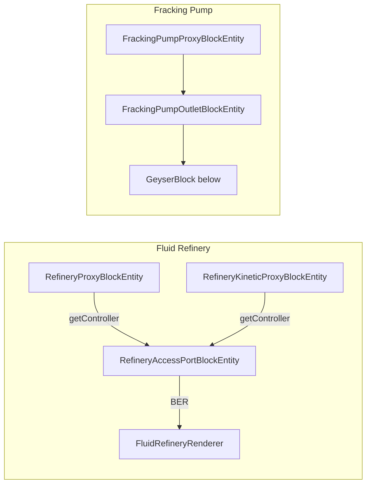

# Resourceful Refinement — Agent Project Overview

High-level map of the **Resourceful Refinement** NeoForge 1.21.1 addon for **Create** (`resourceful_refinement`). Use this with the Obsidian vault **Resourceful Refinement Design Docs** for gameplay intent and detailed feature specs.

---

## Identity & stack

| Field | Value |
|--------|--------|
| Mod ID | `resourceful_refinement` |
| Root package | `com.resourceful_refinement` |
| Entry class | `ResourcefulRefinementMain` |
| Loader | NeoForge 1.21.1 |
| Hard dependency | Create 6.0.8+ (processing recipes, kinetics, ponder, JEI categories) |
| Java sources | ~115 classes under `src/main/java` |

**Design goal:** Factory-style fluid + item processing — molten minerals, catalysed/purified fluids, alloys, coatings, worldgen geysers, and multiblock machines that mirror Create’s kinetic/processing patterns.

---

## Source layout

```
src/main/java/com/resourceful_refinement/
├── ResourcefulRefinementMain.java     # @Mod entry, capabilities, client BER/layer registration
├── registry/                          # DeferredRegister hub — start here for IDs
├── content/                           # Feature packages (block / BE / recipe / render)
│   ├── refinery/                      # Fluid Refinery multiblock
│   ├── fracking_pump/                 # Fracking Pump multiblock
│   ├── forge_mould/                   # Mechanical Forge Mould
│   ├── casting_depot/                 # Casting Depot (forge partner)
│   ├── sieve/                         # Mechanical Fluid Sieve (stackable)
│   ├── geyser/                        # Worldgen geyser source block
│   ├── fluids/base/                   # GeneralizedFlowingFluid, FluidGroup
│   ├── coating/                       # Tool coatings (data component + JEI)
│   ├── moulds/                        # Consumable mould items
│   └── plushie/                       # Easter-egg decorative block
├── ponders/                           # Create Ponder scenes
└── mixin/                             # ItemStackMixin (coating-related)

src/main/resources/
├── assets/resourceful_refinement/     # models, blockstates, lang, textures
└── data/resourceful_refinement/       # recipes, tags, worldgen structures
```

---

## Bootstrap & registration

### `ModRegistries.init(bus)`

Registers, in order: blocks → items → block entities → fluid types → fluids → recipe types/serializers → creative tab → data components.

### `ResourcefulRefinementMain`

- **Common:** `ModStressValues::register` (Create stress impacts).
- **Capabilities** (`registerCapabilities`): NeoForge fluid/item handlers wired per BE — refinery controller + proxies, sieve stack, forge mould, casting depot, fracking outlet. Logic often delegates to a **controller** BE.
- **Client** (`ClientModEvents` inner class): BER registration, layer definitions, bucket tinting, partial models.

### Other registry / integration classes

| Class | Role |
|--------|------|
| `ModBlocks` | All placeable blocks (mechanical + fluids via `FluidEntry`) |
| `ModItems` | Block items, misc items, moulds; fluid buckets via `FluidEntry` |
| `ModBlockEntities` | BE type suppliers |
| `ModFluids` / `FluidEntry` | Declarative fluid registration (type, source, flowing, block, bucket) |
| `ModFluidTypes` | FluidType + client extensions |
| `ModRecipeTypes` | Custom recipe types + Create `IRecipeTypeInfo` wrappers |
| `ModDataComponents` | `coating_data` on ItemStacks |
| `ModCreativeTab` | Creative inventory tab |
| `ModJeiPlugin` | JEI recipe categories |
| `ModClientEvents` | Ponder plugin, global coating item decorator |
| `ModClientGameEvents` | Coating tooltips |
| `ModToolEvents` | Server tool behaviour (coatings) |
| `ModStressValues` | Kinetic stress for refinery proxy, fracking outlet, sieve, forge |
| `ModPartialModels` | Extra models (shafts, geyser casing) |

---

## Fluids

**Registration pattern:** Each fluid is a `FluidEntry` constructed in `ModFluids.register(name, color, FluidGroup)` which registers type, source/flowing fluids, liquid block, and bucket in one call. All entries are listed in `ModFluids.ENTRIES`.

**Groups** (`FluidGroup`): `RAW`, `CATALYSED`, `ALLOYED`, `PURIFIED`, `CARBORAX` — control flow behaviour via `GeneralizedFlowingFluid` / `GeneralizedFluidType`.

**Implemented fluids (22):** molten crimsite/veridium/ochrum/asurine/scorchia; catalysed iron/copper/gold/zinc/redstone/sparkpowder; silica substrate, molten andesite/brass/netherite blends, durasteel alloy; purified iron/copper/gold/zinc/durasteel; unrefined/catalysed/overcharged carborax, carborax diesel.

**Datapack:** Many progression steps also use Create `mixing` recipes under `data/.../recipe/mixing/`.

---

## Recipe types

| JSON `type` | Java recipe | Serializer | Primary machine |
|-------------|-------------|------------|-----------------|
| `resourceful_refinement:fluid_refinery` | `FluidRefineryRecipe` | Create `StandardProcessingRecipe.Serializer` | Fluid Refinery |
| `resourceful_refinement:mechanical_fluid_sieve` | `MechanicalSieveRecipe` | Standard processing | Mechanical Sieve |
| `resourceful_refinement:mechanical_forge_mould` | `MechanicalForgeMouldRecipe` | Custom (`casting` bool field) | Forge Mould |
| `resourceful_refinement:coating` | `CoatingRecipe` | Custom | Applied via tool + forge (not a station GUI) |
| `resourceful_refinement:fracking_pump` | `FrackingPumpRecipe` | Custom | Fracking Pump (geyser pairing) |

**Forge mould modes:** Same recipe type; `"casting": true` requires a `CastingDepot` below the mould (fluid-only output to depot). Non-casting recipes need item + fluid and drop output on belt/depot below.

**Also in datapack:** `shaped_crafting`, Create `mixing`, `coating`, `fracking`, `fluid_refinery`, `mechanical_forge_mould`, `mechanical_fluid_sieve` folders under `data/resourceful_refinement/recipe/`.

---

## Content features — class map

Convention per feature: **Block** → **BlockEntity** → optional **proxy blocks** → **Renderer** (+ **Layers** / **Model** for segmented BER) → **Item** (+ **ItemRenderer** via `initializeClient`) → **recipe** package + **RecipeCategory** for JEI.

### Blender Blade (`content/refinery`)

| Role | Class |
|------|--------|
| Block | `BlenderBladeBlock` |
| BE | `BlenderBladeBlockEntity` (extends Create kinetic) |
| BER | `BlenderBladeRenderer` |
| Item | `BlenderBladeItem` → `BlenderBladeItemRenderer` |

Shaft-mounted hazard blade; used **inside** assembled Fluid Refinery layers. When spinning (|speed| ≥ 8), pushes entities tangentially in the blade plane and deals 2 damage every 10 ticks — see `BlenderBladeBlockEntity` and design doc `Resourceful Refinement Design Docs/Blender Blade.md`. Not a recipe machine on its own.

**Registry:** `ModBlocks.BLENDER_BLADE`, `ModBlockEntities.BLENDER_BLADE`, `ModItems.BLENDER_BLADE`.

---

### Fluid Refinery (`content/refinery`)

Multiblock: **controller** + invisible **proxies**; segmented client rendering from access port only.

| Role | Class |
|------|--------|
| Controller block | `RefineryAccessPortBlock` |
| Controller BE | `RefineryAccessPortBlockEntity` — tanks, crafting, heat, proxy list, assembly state |
| Structure logic | `RefineryStructureHelper` — validate/assemble/disassemble 3×3×(3–8) layout |
| Proxy (fluid/item IO) | `RefineryProxyBlock` / `RefineryProxyBlockEntity` |
| Proxy (kinetic/shaft) | `RefineryKineticProxyBlock` / `RefineryKineticProxyBlockEntity` |
| BER (controller) | `FluidRefineryRenderer` — stacks base/middle/top/blender segments |
| Proxy BER | `RefineryProxyRenderer`, `RefineryKineticProxyRenderer` |
| Models | `RefineryBaseModel`, `RefineryMiddleModel`, `RefineryTopModel`, `RefineryBlenderModel`, `RefineryLayers` |
| Recipe | `FluidRefineryRecipe`, `FluidRefineryRecipeInput`, `FluidRefineryRecipeCategory` |

**Assembly:** Right-click access port → `RefineryStructureHelper.tryAssemble` replaces structure blocks with proxies; stores original states for disassembly. Breaking any proxy or invalid block disassembles.

**Capabilities:** Registered in main mod class — output/fluid on access port front; fuel on bottom corners via controller mapping; proxies delegate `getFluidHandlerForProxy` / `getItemHandlerForProxy` on controller.

**Note:** Design doc mentions optional 5×5 base; **code implements 3×3** (see ASCII diagram in `RefineryStructureHelper`).

**Registry:** `REFINERY_ACCESS_PORT`, `REFINERY_PROXY`, `REFINERY_KINETIC_PROXY` — proxy blocks have **no** survival item.

---

### Mechanical Forge Mould (`content/forge_mould`)

| Role | Class |
|------|--------|
| Block | `MechanicalForgeMouldBlock` |
| BE | `MechanicalForgeMouldBlockEntity` (kinetic press animation, tanks, recipe cache) |
| BER | `ForgeMouldRenderer` + `ForgeMouldCasingModel`, `ForgeMouldPressModel`, `ForgeMouldTubeModel`, `ForgeMouldLayers` |
| Item | `MechanicalForgeMouldItem` → `ForgeMouldItemRenderer` |
| Recipe | `MechanicalForgeMouldRecipe`, `MechanicalForgeMouldRecipeInput`, `MechanicalForgeMouldRecipeCategory` |

**IO:** Fluid top; item front; output ejected below (belt/depot) or casting mode to depot.

---

### Casting Depot (`content/casting_depot`)

| Role | Class |
|------|--------|
| Block | `CastingDepotBlock` (extends Create depot behaviour) |
| BE | `CastingDepotBlockEntity` |
| BER | `CastingDepotRenderer`, `CastingDepotModel`, `CastingDepotLayers` |
| Item | `CastingDepotItem` → `CastingDepotItemRenderer` |

Enables forge mould `"casting": true` recipes when placed directly below the mould.

---

### Mechanical Fluid Sieve (`content/sieve`)

| Role | Class |
|------|--------|
| Block | `MechanicalFluidSieveBlock` (stackable — `stackIndex` / `stackSize` on BE) |
| BE | `MechanicalFluidSieveBlockEntity` — bottom block is controller |
| BER | `MechanicalSieveRenderer` + casing/cog layer models |
| Item | `MechanicalSieveItem` → `MechanicalSieveItemRenderer` |
| Recipe | `MechanicalSieveRecipe`, `MechanicalSieveRecipeInput`, `MechanicalSieveRecipeCategory` |

**IO:** Fluid in top of stack; fluid out bottom; item by-products out front of bottom block. Rotation from sides (not front).

---

### Fracking Pump (`content/fracking_pump`)

Multiblock on top of `geyser_block`; glue-assembled per design doc.

| Role | Class |
|------|--------|
| Outlet block | `FrackingPumpOutletBlock` |
| Outlet BE | `FrackingPumpOutletBlockEntity` — controller, tanks, recipe |
| Proxy | `FrackingPumpProxyBlock` / `FrackingPumpProxyBlockEntity` |
| BER | `FrackingPumpRenderer` + `FrackingPump*Model`, `FrackingPumpLayers` |
| Item | `FrackingPumpOutletItem` → `FrackingPumpOutletItemRenderer` |
| Recipe | `FrackingPumpRecipe`, `FrackingPumpRecipeInput`, `FrackingPumpRecipeCategory` |

**Registry:** `FRACKING_PUMP_OUTLET`, `FRACKING_PUMP_PROXY` (proxy not in creative tab as item).

---

### Geyser (`content/geyser`)

| Role | Class |
|------|--------|
| Block | `GeyserBlock` — unbreakable in survival, NBT/fluid variant |
| BE | `GeyserBlockEntity` — random tick spawns fluid source above |
| BER | `GeyserRenderer` |
| Item | `GeyserItem` → `GeyserItemRenderer` (creative/debug placement) |

**Worldgen:** `data/resourceful_refinement/worldgen/structure*` — ore/cave/nether geyser templates placing tagged geysers.

---

### Coatings (`content/coating`)

Not a block — **data component** on tools.

| Role | Class |
|------|--------|
| Data | `CoatingData`, `CoatingType` |
| Component | `ModDataComponents.COATING_DATA` |
| Recipe | `CoatingRecipe` (in `forge_mould/recipe` package path) |
| Client | `CoatingItemDecorator`, `CoatingRecipeCategory` |
| Server | `ModToolEvents` |
| Mixin | `ItemStackMixin` |

---

### Misc

| Feature | Classes |
|---------|---------|
| Mould items | `MouldItem` — `ingot_mould`, `shaft_mould` with break chances on forge use |
| Plushie | `PlushieBlock`, `PlushieBlockEntity`, `PlushieRenderer`, `PlushieModel`, `PlushieItem` |
| Items only | `ferrous_crystal`, `flux_dust`, `durasteel_ingot`, `durasteel_sheet` |

---

## Rendering architecture

Two parallel client paths:

1. **Block entity renderers (BER)** — registered in `ResourcefulRefinementMain.ClientModEvents.registerRenderers`. Used for world multiblocks and kinetic animations.
2. **Item BEWLR** — custom `BlockEntityWithoutLevelRenderer` subclasses; wired through `Item.initializeClient(IClientItemExtensions)` on block items that need 3D in hand/GUI.

**Segmented multiblocks (refinery, fracking pump):** `*Layers` enum → `registerLayerDefinition` → BER on **controller/outlet** iterates height and draws base + repeated middle + top models. Proxy blocks are invisible collision/connection shells.

**Create reuse:** Kinetic BEs extend `KineticBlockEntity`; refinery controller extends `SmartBlockEntity`; partial shaft models from `ModPartialModels`; stress via `BlockStressValues.IMPACTS`.

---

## Multiblock & controller patterns



**Shared ideas:**

- Proxies store offset `(dx,dy,dz)` from controller and forward capabilities/interaction.
- Controller holds inventories, recipe progress, and render state (`structureHeight`, `assembled`, etc.).
- `RefineryStructureHelper` / fracking assembly code validates Create blocks (casings, glass, blaze burner, tanks, vaults, blender blades).

**Sieve stacking:** Multiple `MechanicalFluidSieveBlockEntity` share one controller at `stackIndex == 0`; capabilities gated by `stackIndex` and face.

---

## Resources (datapack & assets)

| Path | Contents |
|------|----------|
| `assets/.../lang/en_us.json` | Display names |
| `assets/.../models`, `blockstates`, `items` | JSON models; many machines use BER not static block models |
| `data/.../recipe/*` | All custom recipe JSON |
| `data/.../worldgen` | Geyser structures, template pools, biome tags |
| `mixins.resourceful_refinement.json` | Mixin config |

When adding a feature: register in `Mod*` classes, add recipe JSON under matching folder, add lang + optional ponder in `ponders/`.

---

## Ponders & JEI

- **Ponders:** `ModPonders` → `RefineryPonders`, `FrackingPonders`, `SievePonders`, `ForgeAndCastingPonders`.
- **JEI:** `ModJeiPlugin` registers `*RecipeCategory` classes per recipe type.

---

## Design documentation (Obsidian)

| Doc | Topic |
|-----|--------|
| `Primary Design Doc.md` | Vision, fluid list, block list |
| `Fluid Refinery.md` | Multiblock layout, I/O faces, rendering plan |
| `Detailed Fluid Refinery Implementation Plan.md` | Implementation notes |
| `Forge Mould.md` | Forge + casting behaviour |
| `Mechanical Sieve.md` | Sieve behaviour |
| `Fracking Pump.md` / `Fracking Source Blocks.md` | Pump + geysers |
| `Geyser Block.md` | Worldgen sources |
| `Fluid Properties.md` | Fluid tiers |
| `Fluid Processing Recipes.md` | Progression tables |
| `Coating.md` / `Coating Variants.md` | Tool coatings |

Prefer **code** when design docs disagree (e.g. refinery footprint size).

---

## Agent cheat sheet — where to edit

| Task | First files |
|------|-------------|
| New block/item ID | `ModBlocks`, `ModItems`, `ModBlockEntities` |
| New fluid | `ModFluids.register(...)`, tint in main client item colors loop |
| New machine recipe | `ModRecipeTypes`, recipe JSON, `*Recipe.java`, BE tick/match logic |
| Multiblock layout | `RefineryStructureHelper` or fracking assembly in outlet BE |
| Face IO / pipes | `ResourcefulRefinementMain.registerCapabilities` + controller handler methods |
| World rendering | `*Renderer`, `*Layers`, `*Model`, register in `ClientModEvents` |
| Hand/item 3D | `*Item` + `*ItemRenderer` |
| Balance / chains | `data/.../recipe/` + design `Fluid Processing Recipes.md` |
| Worldgen geyser | `data/.../worldgen/` + `GeyserBlockEntity` |

---

## Create integration summary

- **Kinetics:** `KineticBlockEntity`, rotation from shafts/cogs, `ModStressValues`.
- **Processing:** `ProcessingRecipe` / `StandardProcessingRecipe` for refinery & sieve; heat via `HeatCondition`.
- **Behaviours:** `FilteringBehaviour`, goggle info (`IHaveGoggleInformation`) on refinery controller.
- **Fluids:** Create fluid particles; NeoForge `FluidTank` / capabilities API.
- **Depots/belts:** Forge output uses Create deployment patterns below the press.

---

## Known implementation notes

- `casting_mould` from early design is **not** a separate recipe type — use `mechanical_forge_mould` with `"casting": true`.
- `REFINERY_PROXY` / `FRACKING_PUMP_PROXY` are assembly-only blocks (no item).
- Blender blade is both a placed block and a refinery structure component.
- Coating uses **data components** (1.21+), not NBT-only attachments.
- 115 Java files — small enough to grep by feature package before adding parallel abstractions.

---

*Generated for agent onboarding. Update when adding major features or changing multiblock contracts.*
